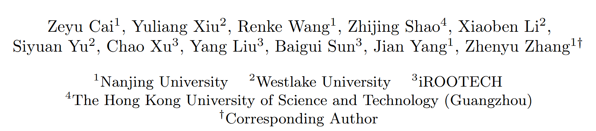

OmniFit是一个project page，现在帮我完成两个任务。

1. 给这个project page添加作者栏目，有以下作者

请帮我添加，同时作者设置成点击可以跳转到作者主页的链接。
各个作者的链接为：
Zeyu Cai: https://zcai0612.github.io/
Yuliang Xiu: https://xiuyuliang.cn/
Renke Wang: https://scholar.google.com/citations?user=BZG8NcEAAAAJ&hl=en
Zhijing Shao: https://initialneil.github.io/
Xiaoben Li: https://xiaobenli00.github.io/publications/
Siyuang Yu: https://ysysimon.com/
Chao Xu: https://scholar.google.cz/citations?user=zlq2S_0AAAAJ&hl=zh-CN&oi=sra
Yang Liu: https://scholar.google.cz/citations?user=t1emSE0AAAAJ&hl=zh-CN&oi=sra
Baigui Sun: https://scholar.google.cz/citations?user=ZNhTHywAAAAJ&hl=zh-CN
Jian Yang: https://scholar.google.cz/citations?hl=zh-CN&user=6CIDtZQAAAAJ
Zhenyu Zhang: https://jessezhang92.github.io/

记得标明作者单位和通讯。

1. 美化这个project page的整体布局和设计，使其更具吸引力和易读性。可以使用CSS来调整字体、颜色、间距等元素，以提升用户体验。同时，确保页面在不同设备上的响应式设计，以适应各种屏幕尺寸。页面的风格可以参考现代简约风格，保证科研项目页面的专业性和清晰度，同时也要注重视觉效果和用户体验。可以使用一些现代的设计元素，如卡片式布局、简洁的图标和清晰的排版，以提升页面的整体美感和可读性。

